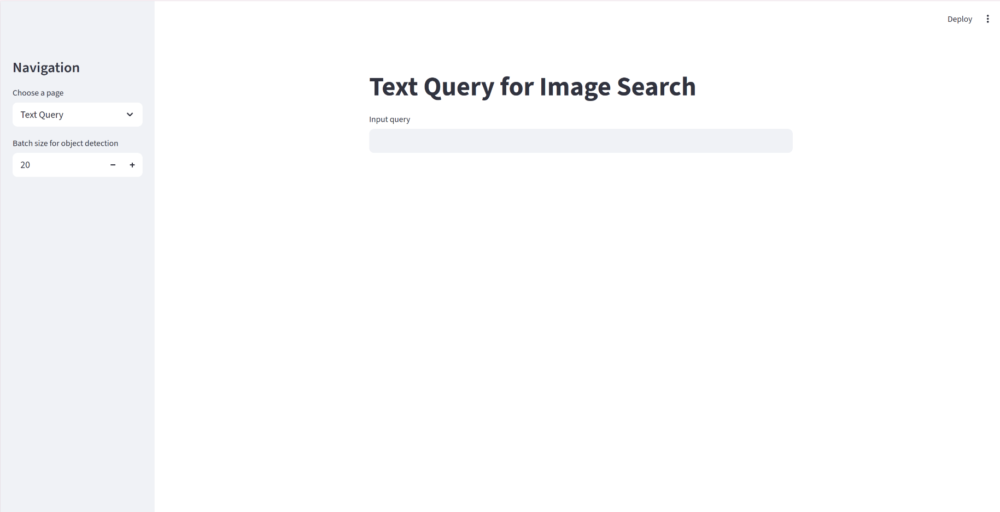
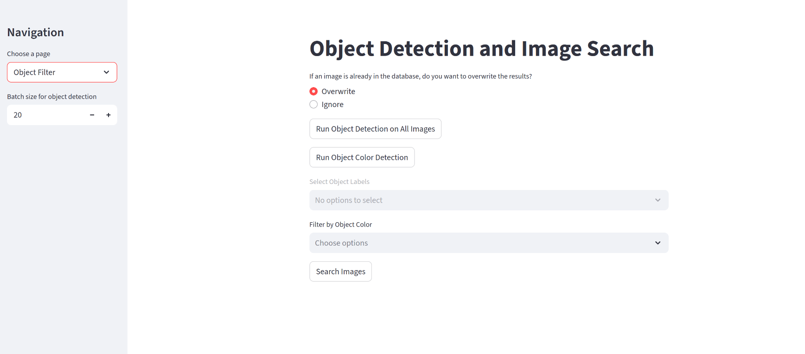
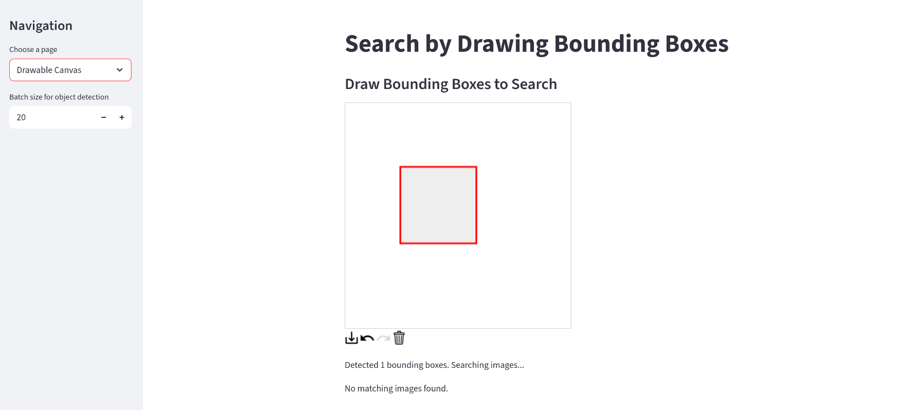

# Object Detection for AIC

## Overview
This project provides an interactive Streamlit application for exploring a large video archive through object detection, semantic search, and frame-level navigation. It combines Ultralytics YOLOv10 for image detection, CLIP embeddings stored in Qdrant for text-to-image retrieval, and a lightweight SQLite database for analytics and filtering.

## Core Features
- Object detection pipeline that batches frames, stores detections in SQLite, and can overwrite or ignore existing results.
- Optional dominant color inference for detected objects to support multi-modal filtering.
- Qdrant-backed text query UI that translates Vietnamese queries to English and retrieves the closest CLIP embeddings.
- Drawable canvas search to locate frames whose detected bounding boxes match user sketches.
- Video frame inspector with frame stepping, CSV export, and DJV integration for deep review of matching footage.

## Project Layout
- `app.py` – Streamlit entry point with navigation across Text Query, Object Filter, Drawable Canvas, and Video Frame tools.
- `detector.py` – YOLOv10 utilities for batch inference and frame discovery.
- `database.py` – SQLite schema and CRUD helpers for detections, colors, and frame mappings.
- `color_detection.py` – Dominant color extraction via K-Means clustering.
- `filter_model.py` – Optional BERT NER pipeline and CLIP-based text filters.
- `text_query.py` – CLIP text search experience backed by Qdrant and automatic translation.
- `video_player.py` – Frame-by-frame video navigator with CSV export utilities.
- `add_mapping.py` – One-off script that ingests CSV metadata into the `image_mapping` table.

## Prerequisites
- Python 3.11.x
- A GPU is recommended for YOLO inference but the app can run on CPU with reduced performance.
- Qdrant running at `localhost:6333` (adjustable in `constants.py`). Ensure your CLIP embeddings have already been ingested into the `image_embeddings` collection.
- Stored frames accessible under `ROOT_FOLDER` and source videos under `VIDEO_ROOT_FOLDER` (configure in `constants.py`).
- Optional: [DJV](https://djv.sourceforge.io/) installed and on PATH for opening source videos from the Video Frame page.

## Environment Setup
1. Clone the repository and navigate into it.
2. Create and activate a virtual environment:
	```bash
	python3 -m venv .venv
	source .venv/bin/activate
	```
3. Install dependencies:
	```bash
	pip install --upgrade pip
	pip install -r requirements.txt
	```
4. Verify the installation:
	```bash
	pip check
	```
5. Ready Qdrant:
    ```
    docker compose up -d
    ```

### Configuration
- Edit `constants.py` to point `ROOT_FOLDER`, `VIDEO_ROOT_FOLDER`, and `DB_NAME` at your local paths. The default assumes frames at `/media/jc/Home/extracted_frames/` and videos under `/media/jc/CRIT Data/archives/`.
- If you use a remote Qdrant instance or different credentials, update `QDRANT_CLIENT` accordingly.
- Place `image_detection.db` beside the project or adjust `DB_NAME` to the correct location. You can bootstrap it by running Streamlit once (the tables are created automatically) or by importing an existing dump.

### YOLO Weights
`detector.load_yolo_model()` expects the `yolov10x.pt` weights to be available. Ultralytics downloads them automatically on the first run, but you can preload them via `yolo_model = YOLO('yolov10x.pt')` in a Python shell to avoid cold-start latency.

## Preparing Metadata
The app expects an `image_mapping` table that links each frame image to its frame index. To create it from a CSV export (with columns `Image_Path` and `frame_idx`), update the path in `add_mapping.py` and execute:
```bash
python add_mapping.py
```
The script trims the Windows-style prefix `D:\\UIT\\aic\\frames\\` by default; adjust `prefix_to_remove` if your data layout differs.

## Running the Application
Launch the Streamlit UI:
```bash
streamlit run app.py
```
Use the sidebar to select the workflow:
- **Text Query**: Enter Vietnamese or English text. Queries are translated to English, tokenized with OpenAI CLIP, and matched against Qdrant embeddings. Results include buttons to push context into the Video Frame tool.
- **Object Filter**: Trigger YOLO detection on all images under `ROOT_FOLDER`. You can choose to overwrite or skip frames already stored in SQLite, run the color enrichment pass, and filter results by label and color before browsing thumbnails.
- **Drawable Canvas**: Sketch bounding boxes; the app retrieves frames whose detections overlap with the drawn regions (using a 50px tolerance).
- **Video Frame**: Load a source video (e.g., `L01_V001.mp4`), scrub through frames, export frame lists to CSV, or open the clip externally with DJV. Session state keeps selections in sync with other pages.

## Screenshots
- Text Query workflow
	
- Object detection gallery with filters
	
- Drawable canvas search experience
	

## Data Flow
1. **Detection**: `detect_objects_batch()` runs YOLO on batches and stores each `(image_name, object_label, x_min, y_min, x_max, y_max, confidence)` record in `images` (plus optional `object_color`).
2. **Color Annotation**: `color_detection.get_dominant_color()` computes dominant hues for detections lacking a color tag.
3. **Metadata Lookup**: Additional lookups (e.g., frame indices) rely on the `image_mapping` table populated via `add_mapping.py`.
4. **Semantic Search**: `text_query.py` uses CLIP to encode text, normalizes embeddings, and submits vector searches to Qdrant; results can be exported as CSV.

## Notes & Known Issues
- Ensure `translate` >= 3.6.1 is installed; the Streamlit text page imports `Translator` from `translate`.
- `insert_object_detection` currently defines eight SQL placeholders but passes seven values. Either add the missing column (e.g., `object_color`) to the insert or remove the extra placeholder if you hit a `sqlite3.ProgrammingError`.
- The drawable canvas uses absolute pixel coordinates (Streamlit canvas resolution). Align your sketches proportionally to the saved detections for best results.
- Long-running detection jobs can be CPU/GPU intensive; monitor system load when processing large archives.

## Troubleshooting
- **ModuleNotFoundError**: Re-run `pip install -r requirements.txt`. The project relies on `git+https://github.com/openai/CLIP.git`, so make sure `git` is available in your environment.
- **Qdrant connection**: Confirm the service is reachable and that the `image_embeddings` collection exists. Use `qdrant_client.http.collections_api.get_collection()` in a Python shell for diagnostics.
- **DJV launch fails**: Install DJV or remove the `st.button("Open video in DJV", ...)` block if not needed.

## Contributing
1. Fork the repository and create a feature branch.
2. Keep Python code formatted and add succinct comments when logic is non-obvious.
3. Run `streamlit run app.py` locally to validate UI changes.
4. Open a pull request describing your changes, data assumptions, and testing steps.

## License
The original repository does not specify a license. Add one before redistributing the codebase.
